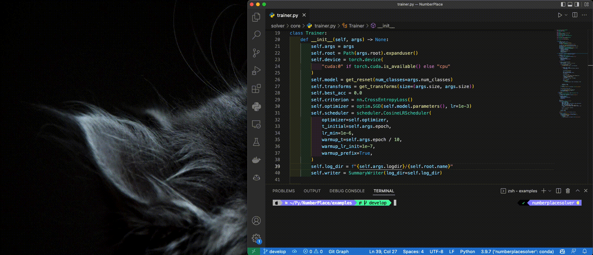
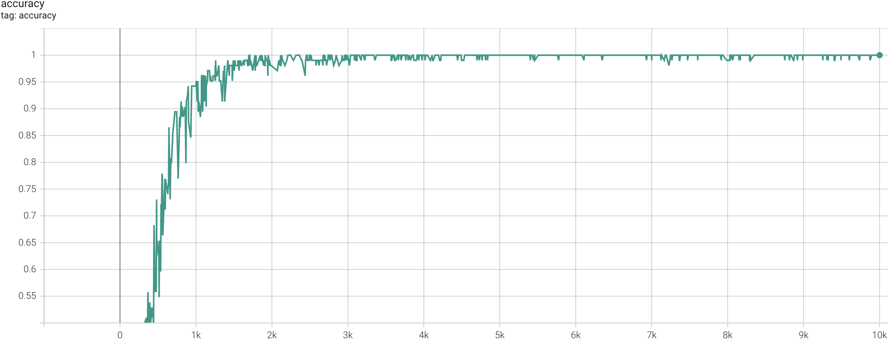

# NumberPlaceSolver
## Description
This is a tool based on ResNet-18 to analyze Number Place (Sudoku) from images.



## Quick Start
<details>
<summary>Installation</summary>

```zsh
pip install -r requirements.txt
```
</details>

<details>
<summary>Demo</summary>

```sh
python3 examples/inference.py
```
or visit [demo.ipynb](demo.ipynb)


</details>

<details>
<summary>Training on custom data</summary>

```sh
python3 examples/train.py
tensorboard --logdir logs
```
### Accuracy


### Loss

</details>

<details>
<summary>Detection from image</summary>

```zsh
python3 examplea/detect.py

# 0 9 0 6 0 1 0 2 0
# 8 0 0 0 0 0 0 0 3
# 0 0 3 8 4 2 5 0 0
# 7 0 6 0 0 0 9 0 8
# 0 0 1 0 5 0 7 0 0
# 3 0 5 0 0 0 4 0 6
# 0 0 9 5 1 8 6 0 0
# 4 0 0 0 0 0 0 0 1
# 0 1 0 2 0 4 0 8 0
```
</details>
