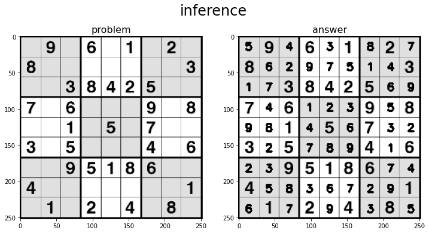
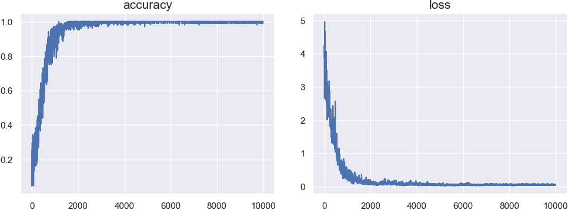

<div align="center">

<h1>NumberPlaceSolver</h1>

[](https://github.com/a5chin/NumberPlaceSolver/actions/workflows/pytest.yml)
[](https://github.com/a5chin/NumberPlaceSolver/actions/workflows/linting.yml)
[](https://img.shields.io/pypi/l/ansicolortags.svg)

[](https://www.python.org/)
[](https://pytorch.org/)
[](https://numpy.org/)

</div>

## Description
This is a tool based on ResNet-18 to analyze Number Place (Sudoku) from images.


## Install
```sh
pip install -r requirements.txt
```

## Demo
```sh
python example/inference.py --image assets/data/problem/example.png
```


## Training on custom data
```sh
python examples/train.py --root assets/data/NumberPlaceDataset
tensorboard --logdir logs
```


## Detection from image
```sh
python examplea/detect.py --image assets/data/problem/example.png

# 0 9 0 6 0 1 0 2 0
# 8 0 0 0 0 0 0 0 3
# 0 0 3 8 4 2 5 0 0
# 7 0 6 0 0 0 9 0 8
# 0 0 1 0 5 0 7 0 0
# 3 0 5 0 0 0 4 0 6
# 0 0 9 5 1 8 6 0 0
# 4 0 0 0 0 0 0 0 1
# 0 1 0 2 0 4 0 8 0
```

## Solve from list
```sh
python example/solve.py

# 5 9 4 6 3 1 8 2 7
# 8 6 2 9 7 5 1 4 3
# 1 7 3 8 4 2 5 6 9
# 7 4 6 1 2 3 9 5 8
# 9 8 1 4 5 6 7 3 2
# 3 2 5 7 8 9 4 1 6
# 2 3 9 5 1 8 6 7 4
# 4 5 8 3 6 7 2 9 1
# 6 1 7 2 9 4 3 8 5
```
